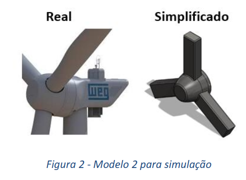

### Artigo-estudo-aerodinamico-do-cubo-do-rotor-de-um-gerador-eolico - Project finished.

  
INTRODUÇÂO

Nesse trabalho foi estudado o comportamento aerodinâmico do cubo de um rotor eólico em função de sua geometria, utilizando dois métodos para a validação do estudo: método computacional e método experimental.O grupo tomou como base dois parâmetros geométricos,sendo eles: modelo 1 que consiste em um bico mais ovalizado (Figura 1) e modelo 2 contendo no bico uma áreade seção transversal plana (Figura 2), gerando a partir de modelos reais, modelos simplificados e em menor escala para viabilizar os ensaios.

 
  
 
    
    
    

  

  
SIMULAÇÃO NO CFX-ANSYS: MODELO 1
  

 
  
 
    
    

    

  

SIMULAÇÃO NO CFX-ANSYS: MODELO 2

 
  
 
    
    

  
      

  

SIMULAÇÃO NO CFX-ANSYS: MODELO 3

 
  
 
    
    

      
      
   
